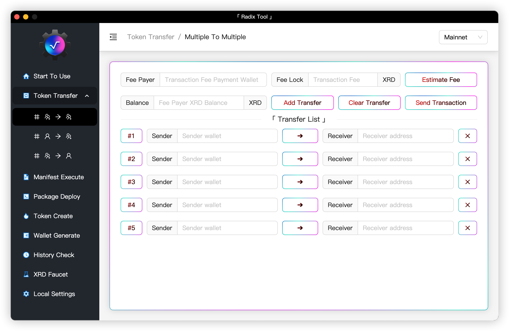
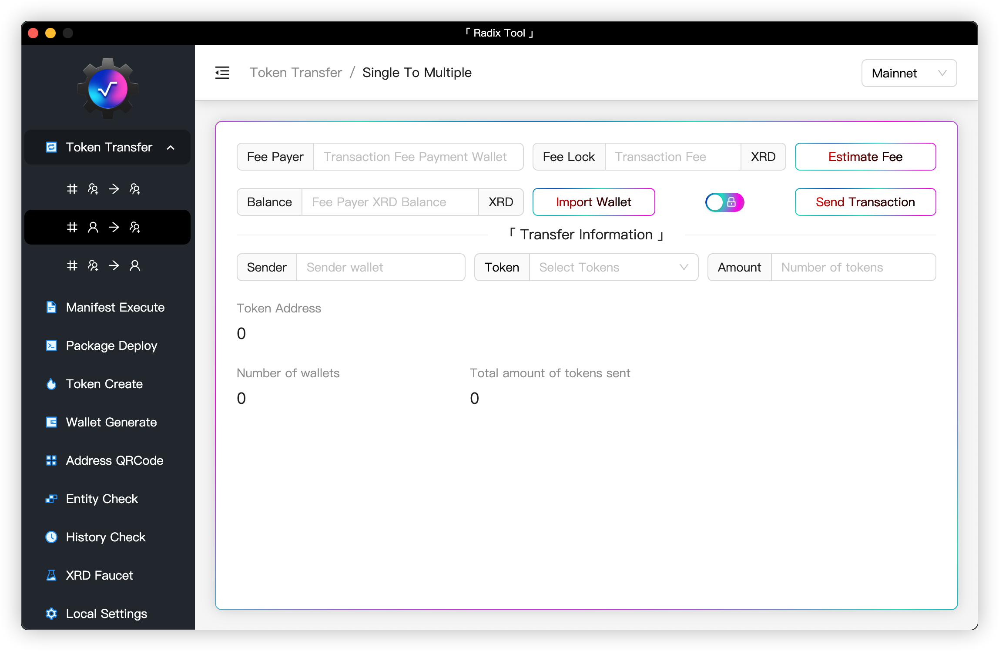
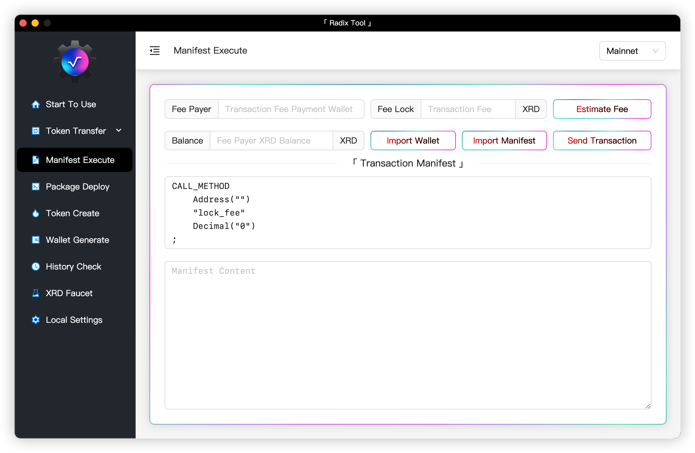
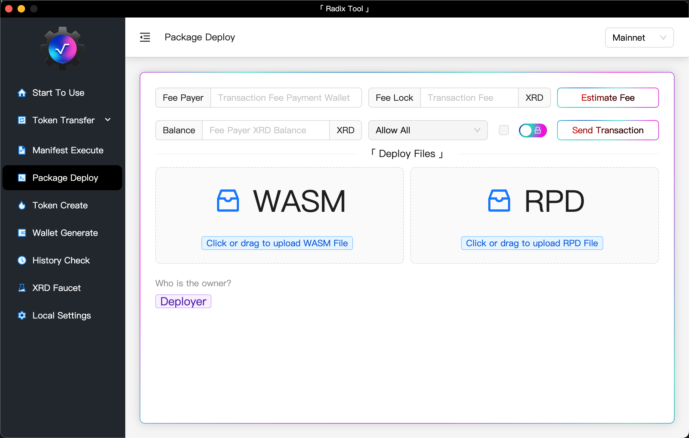
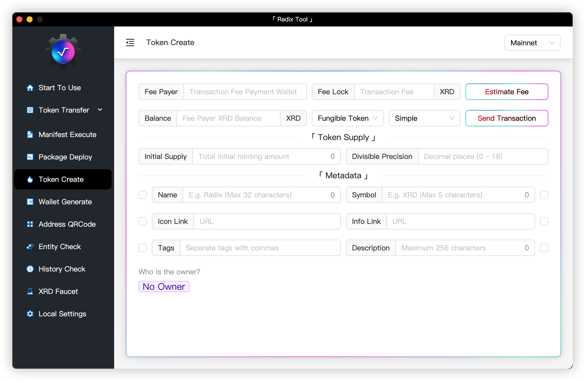
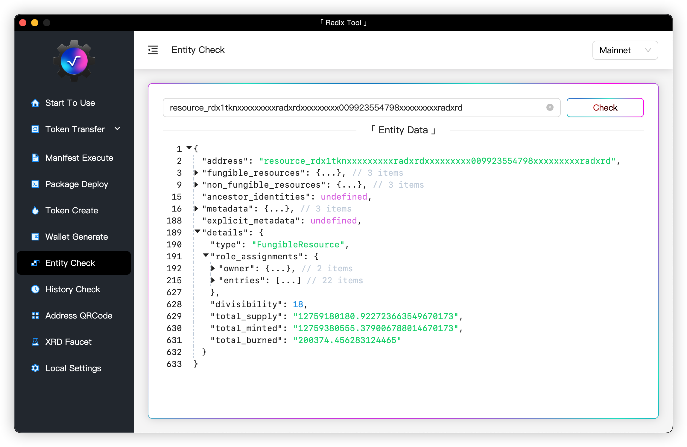
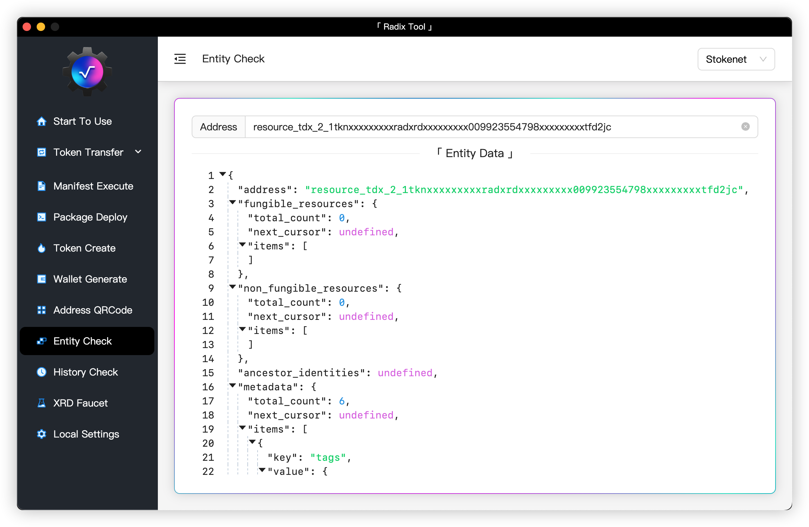
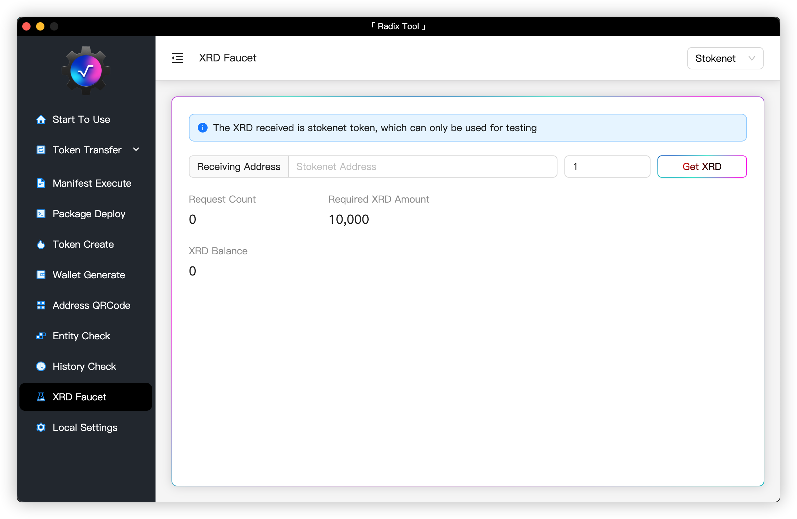
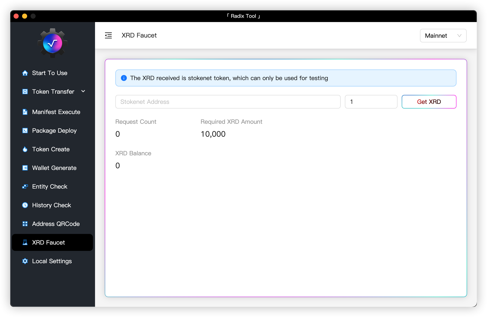

<div align="center">
    
</div>

<h3 align="center">English | <a href="README_CN.md">中文</a> | <a href="https://github.com/atlantis-l/Radix-Desktop-Tool/releases">Download</a></h3>

<h3 align="center"><a href="https://t.me/radix_desktop_tool">Join Telegram</a></h3>

<h2 align="center">「 Radix Tool 」</h2>

<h3 align="center">
    A tool that can interact with <a href="https://www.radixdlt.com/">Radix</a> Network
</h3>

> The basic concepts need to know when using the tool can be found [here](https://docs.radixdlt.com/)

## Usage

```shell
# First Step
npm install
# Second Step
npm run dev
```

## Build App

```shell
# Windows
npm run build-win
# MacOS
npm run build-mac
# Linux
npm run build-linux
# The resulting executable is stored in the release directory
```

## App Display



















## Donation

```shell
Radix: account_rdx1296zfsm5jza4h86mp48dfm2dqpluecyx880zazgxrp6shsf0shk3cy

Ethereum: 0x6eafbeab09A6b0710063f7F1f076436A6b563ccf
```

## Disclaimer

> This tool is only used for learning and communication, and the risk of using this tool is solely borne by the user, and the author of the tool does not assume any responsibility.
