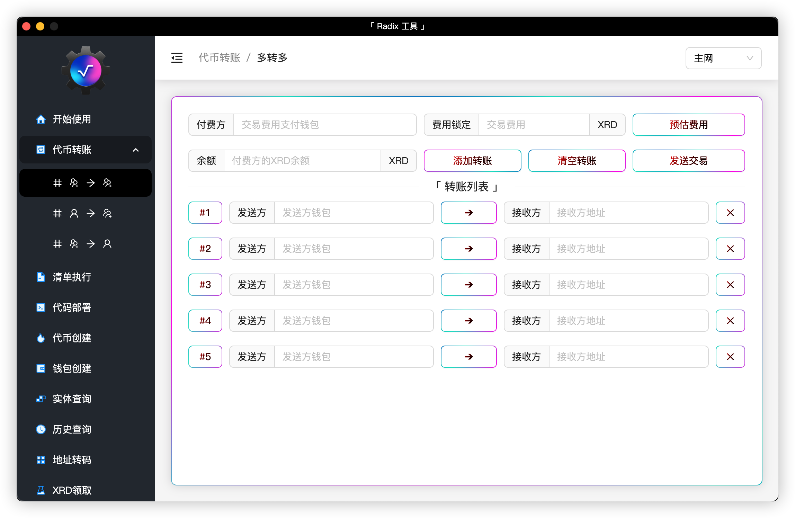
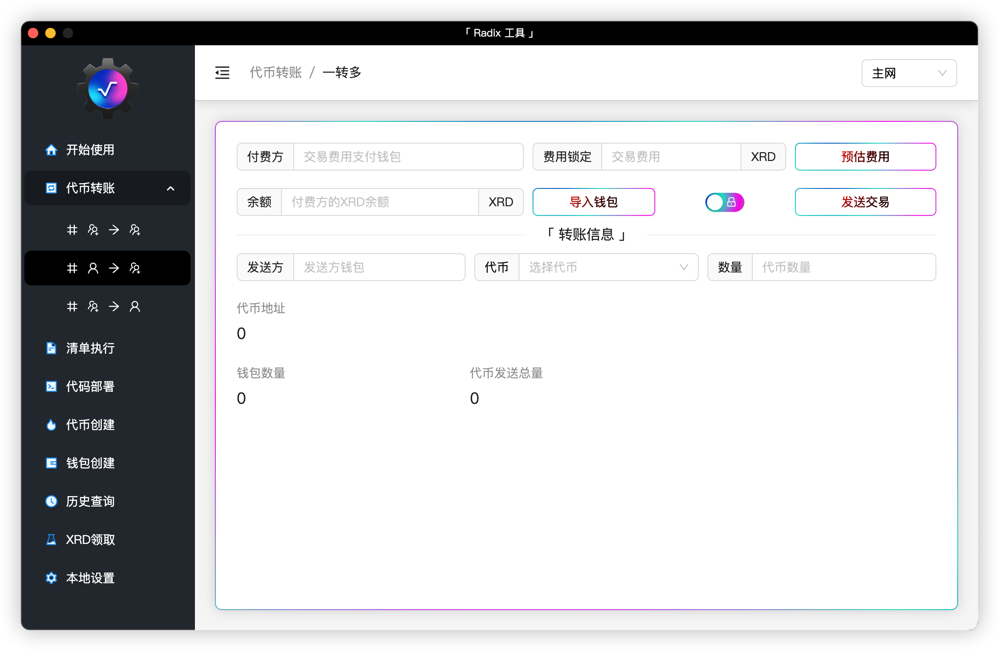
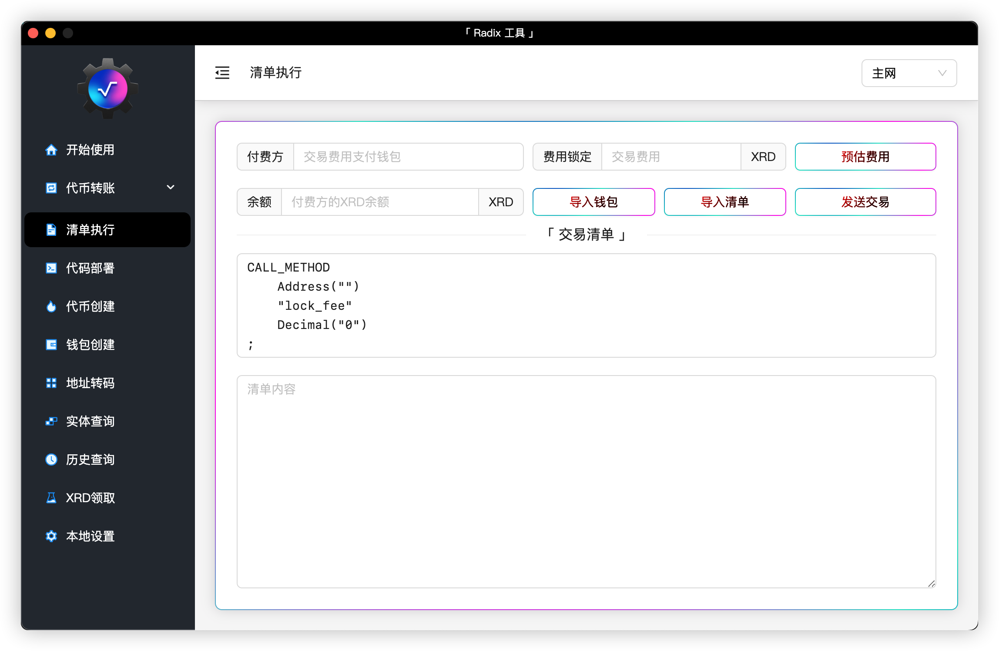
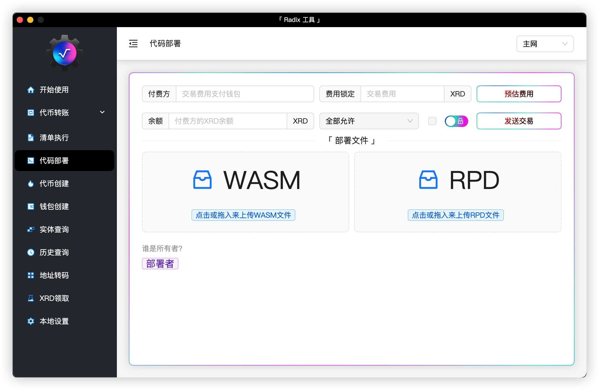
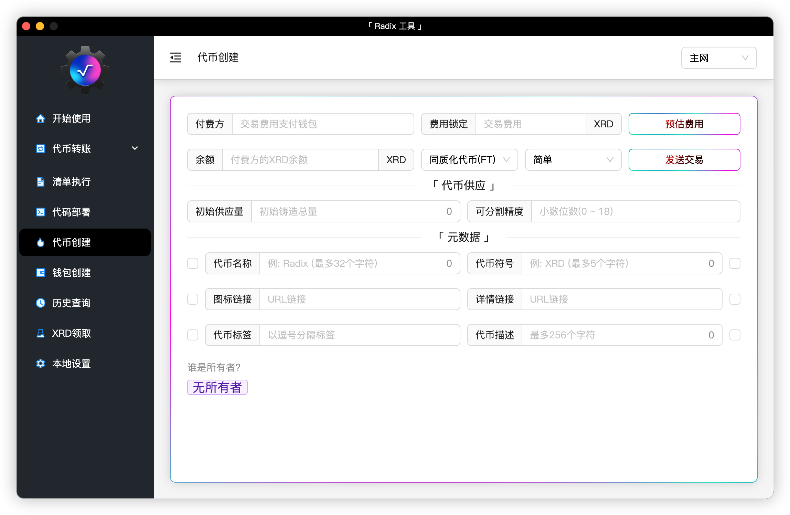
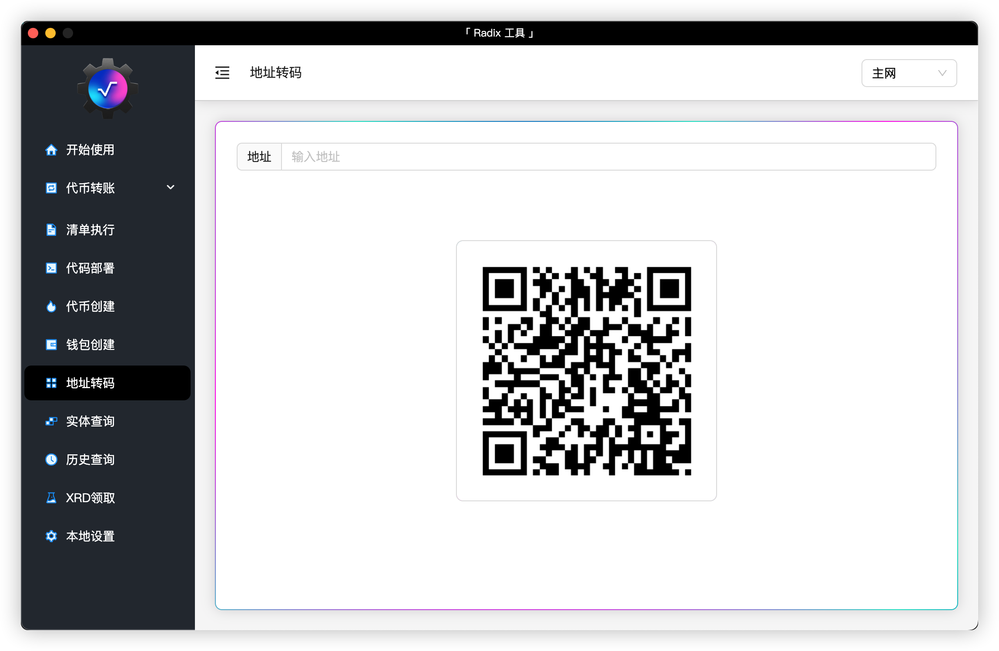
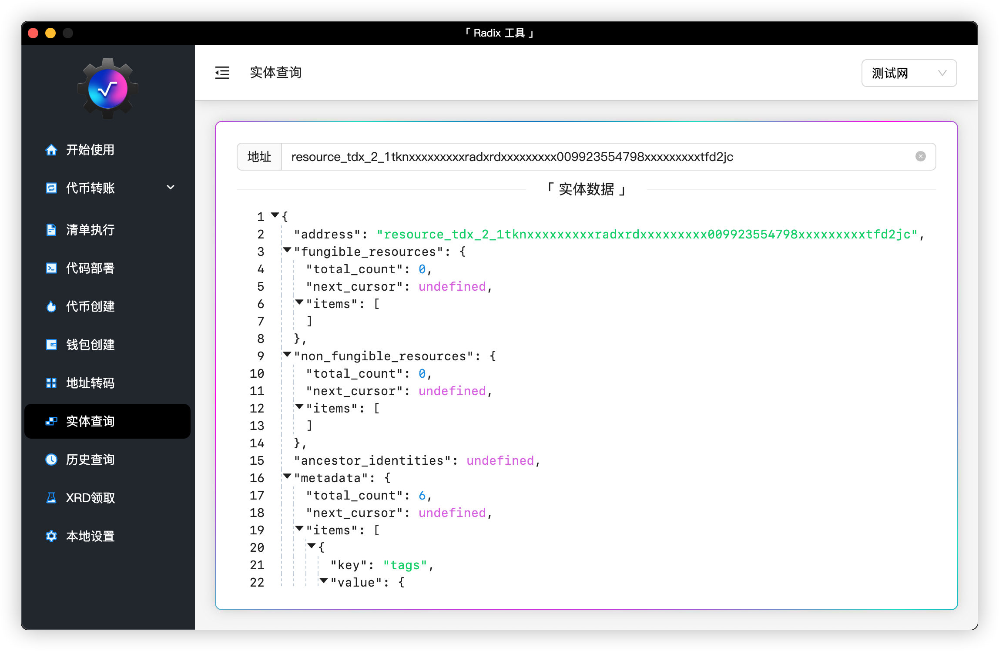
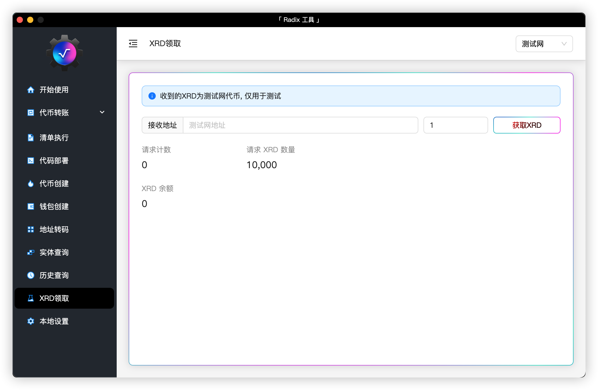
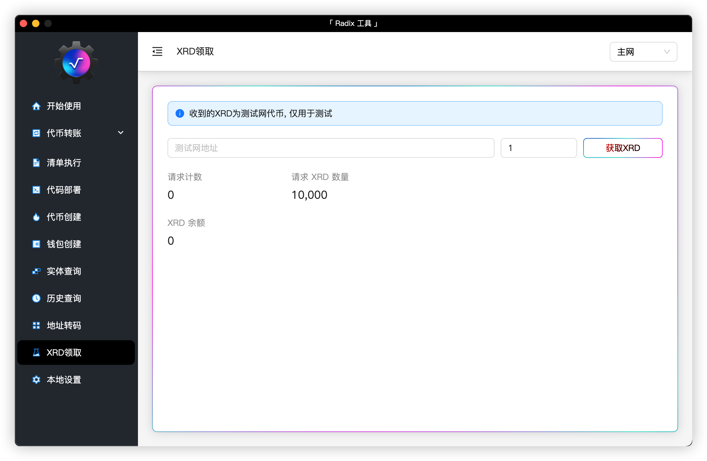

<div align="center">
    
</div>

<h3 align="center">中文 | <a href="README.md">English</a> | <a href="https://github.com/atlantis-l/Radix-Desktop-Tool/releases">下载</a></h3>

<h3 align="center"><a href="https://t.me/radix_desktop_tool">加入电报</a></h3>

<h2 align="center">「 Radix 工具 」</h2>

<h3 align="center">
    一个可以与 <a href="https://www.radixdlt.com/">Radix</a> 网络交互的工具
</h3>

> 使用工具时所需了解的基本概念可以在[这里](https://docs.radixdlt.com/)找到

## 运行程序

```shell
# 第一步
npm install
# 第二步
npm run dev
```

## 构建应用

```shell
# Windows
npm run build-win
# MacOS
npm run build-mac
# Linux
npm run build-linux
# 生成的可执行文件存放在release目录
```

## 应用展示



















## 捐赠

```shell
Radix: account_rdx1296zfsm5jza4h86mp48dfm2dqpluecyx880zazgxrp6shsf0shk3cy

Ethereum: 0x6eafbeab09A6b0710063f7F1f076436A6b563ccf
```

## 免责声明

> 本工具仅供学习与交流使用，使用本工具所存在的风险将完全由使用者承担，工具作者不承担任何责任。
